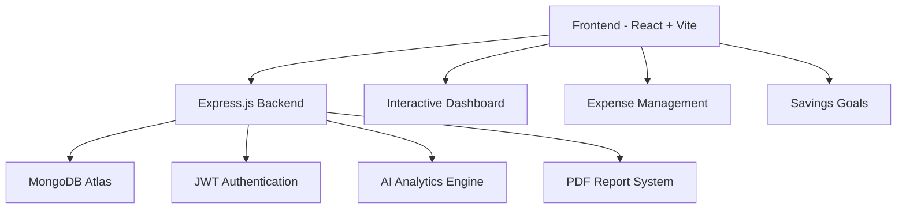

<!-- ======================= FUTURISTIC HEADER ======================= -->

<div align="center">


<br>


<br><br>


</div>

---

# ⚡ Overview

**Track & Save** is a next-generation AI-powered personal finance management platform designed to deliver intelligent financial tracking, advanced analytics, secure cloud integration, and an immersive modern fintech experience.

Built with a scalable full-stack architecture, the platform enables users to manage income, expenses, savings goals, recurring payments, and downloadable financial reports through a highly interactive and responsive dashboard.

---

# ✨ Core Features

<table>
<tr>
<td width="50%">

## 💰 Financial Management
- Real-time income tracking
- Dynamic expense management
- Savings goal monitoring
- Recurring payment support
- Transaction categorization

</td>

<td width="50%">

## 🤖 AI Intelligence
- Smart spending analysis
- Financial optimization insights
- AI-generated recommendations
- Dynamic analytics dashboard
- Trend prediction system

</td>
</tr>

<tr>
<td width="50%">

## 🔐 Security & Authentication
- JWT authentication
- Protected routes
- Secure REST APIs
- Session management
- MongoDB cloud storage

</td>

<td width="50%">

## 📄 Reporting System
- PDF report generation
- Financial summaries
- Monthly analytics export
- Downloadable reports
- Data persistence support

</td>
</tr>
</table>

---

# 🧠 System Architecture



---

# 🛠 Technology Stack

<div align="center">

| Category | Technologies |
|---|---|
| Frontend | React.js, Vite, JavaScript, HTML5, CSS3 |
| Backend | Node.js, Express.js |
| Database | MongoDB Atlas |
| Authentication | JWT |
| Analytics | Recharts |
| Deployment | Vercel, Render |

</div>

---

# 🚀 Installation & Setup

## Clone Repository

```bash
git clone https://github.com/your-username/track-save-app.git
```

---

## Frontend Setup

```bash
cd frontend
npm install
npm run dev
```

---

## Backend Setup

```bash
cd backend
npm install
node server.js
```

---

# 🔑 Environment Variables

Create `.env` inside backend folder:

```env
MONGO_URI=your_mongodb_connection
JWT_SECRET=your_secret_key
```

---

# 🌌 Platform Highlights

<div align="center">

| Feature | Status |
|---|---|
| AI Analytics Dashboard | ✅ |
| MongoDB Integration | ✅ |
| JWT Authentication | ✅ |
| PDF Reports | ✅ |
| Responsive UI | ✅ |
| Cloud Deployment | ✅ |
| Recurring Payments | ✅ |
| LocalStorage Support | ✅ |

</div>

---

# 📈 Future Roadmap

- AI Voice Financial Assistant
- Real-Time Banking API Integration
- Fraud Detection System
- Investment Portfolio Tracking
- Mobile App Development
- Push Notification System
- Multi-User Collaboration
- Advanced Financial Forecasting

---

# 🧩 Challenges Faced

During development, several technical and architectural challenges were encountered:

- Full-stack authentication integration
- MongoDB connectivity debugging
- Frontend-backend synchronization
- API deployment configuration
- State management optimization
- Cloud deployment troubleshooting

These were resolved through modular architecture implementation, scalable backend structuring, API debugging, and deployment optimization.

---

# 📌 Project Status

```diff
+ Frontend Development Completed
+ Backend Integration Completed
+ MongoDB Connected
+ Authentication Implemented
+ Deployment Configured
+ Active Development Ongoing
```

---

# 👨‍💻 Developer

<div align="center">

## Soham Ghosh

Full Stack Developer • FinTech Builder • AI Enthusiast

</div>

---

# ⭐ Support The Project

If you found this project useful, consider giving it a ⭐ on GitHub.

---

<!-- ======================= FUTURISTIC FOOTER ======================= -->

<div align="center">


</div>